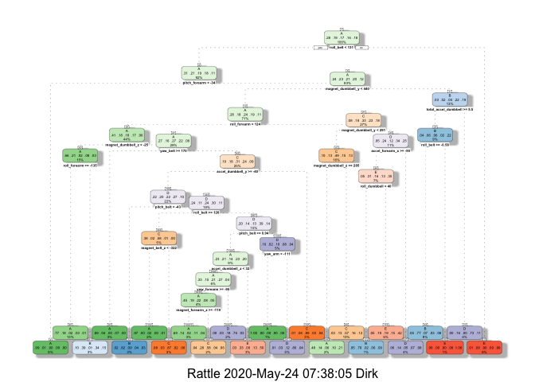
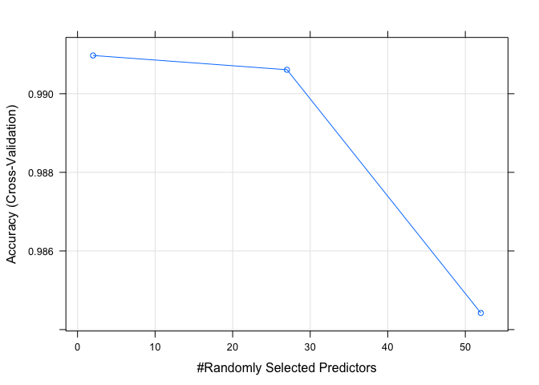

## Background

Using devices such as Jawbone Up, Nike FuelBand, and Fitbit it is now possible to collect a large amount of data about personal activity relatively inexpensively. These type of devices are part of the quantified self movement – a group of enthusiasts who take measurements about themselves regularly to improve their health, to find patterns in their behavior, or because they are tech geeks. One thing that people regularly do is quantify how much of a particular activity they do, but they rarely quantify how well they do it.  

In this project, the goal will be to use data from accelerometers on the belt, forearm, arm, and dumbell of 6 participants. They were asked to perform barbell lifts correctly and incorrectly in 5 different ways. More information is available from the website here: <http://groupware.les.inf.puc-rio.br/har> (see the section on the Weight Lifting Exercise Dataset).

## Data

Data is loaded into two datasets:  

* trainingset: serves to training and test datasets [here](https://d396qusza40orc.cloudfront.net/predmachlearn/pml-training.csv)  

* quizset: dataset for to predict variable classe for the quiz [here](https://d396qusza40orc.cloudfront.net/predmachlearn/pml-testing.csv)

The goal of the project is to predict the manner in which the subjects did the exercise. This is the "classe" variable in the training set. Any other variable may be used to predict with. A report describing how the model was built, how cross validation was used, what the expected out of sample error is, and why the particular choices were made. The prediction model is then used to predict 20 different test cases for the quiz section of the assignment.


```r
rm(list = ls())

train_url <- "http://d396qusza40orc.cloudfront.net/predmachlearn/pml-training.csv"
quiz_url <- "http://d396qusza40orc.cloudfront.net/predmachlearn/pml-testing.csv"


trainingset <- read_csv(train_url, na=c("#DIV/0!","NA", ""))
quizset <- read_csv(quiz_url, na=c("#DIV/0!","NA", ""))
```

*trainingset* contains 19622 observations of 160 variables. *quizset* contains 20 observations of 160 variable.

Using `str()` for the first 20 variables shows that the first seven variables of *trainingset* contain data not relevant to the analysis and can be removed. 


```r
str(trainingset[c(1:20)])
```

```
## tibble [19,622 × 20] (S3: tbl_df/tbl/data.frame)
##  $ X1                  : num [1:19622] 1 2 3 4 5 6 7 8 9 10 ...
##  $ user_name           : chr [1:19622] "carlitos" "carlitos" "carlitos" "carlitos" ...
##  $ raw_timestamp_part_1: num [1:19622] 1323084231 1323084231 1323084231 1323084232 1323084232 ...
##  $ raw_timestamp_part_2: num [1:19622] 788290 808298 820366 120339 196328 ...
##  $ cvtd_timestamp      : chr [1:19622] "05/12/2011 11:23" "05/12/2011 11:23" "05/12/2011 11:23" "05/12/2011 11:23" ...
##  $ new_window          : chr [1:19622] "no" "no" "no" "no" ...
##  $ num_window          : num [1:19622] 11 11 11 12 12 12 12 12 12 12 ...
##  $ roll_belt           : num [1:19622] 1.41 1.41 1.42 1.48 1.48 1.45 1.42 1.42 1.43 1.45 ...
##  $ pitch_belt          : num [1:19622] 8.07 8.07 8.07 8.05 8.07 8.06 8.09 8.13 8.16 8.17 ...
##  $ yaw_belt            : num [1:19622] -94.4 -94.4 -94.4 -94.4 -94.4 -94.4 -94.4 -94.4 -94.4 -94.4 ...
##  $ total_accel_belt    : num [1:19622] 3 3 3 3 3 3 3 3 3 3 ...
##  $ kurtosis_roll_belt  : num [1:19622] NA NA NA NA NA NA NA NA NA NA ...
##  $ kurtosis_picth_belt : num [1:19622] NA NA NA NA NA NA NA NA NA NA ...
##  $ kurtosis_yaw_belt   : logi [1:19622] NA NA NA NA NA NA ...
##  $ skewness_roll_belt  : num [1:19622] NA NA NA NA NA NA NA NA NA NA ...
##  $ skewness_roll_belt.1: num [1:19622] NA NA NA NA NA NA NA NA NA NA ...
##  $ skewness_yaw_belt   : logi [1:19622] NA NA NA NA NA NA ...
##  $ max_roll_belt       : num [1:19622] NA NA NA NA NA NA NA NA NA NA ...
##  $ max_picth_belt      : num [1:19622] NA NA NA NA NA NA NA NA NA NA ...
##  $ max_yaw_belt        : num [1:19622] NA NA NA NA NA NA NA NA NA NA ...
```
Also, some columns have missing data ("NA", e.g. *kurtosis_roll_belt*) or undefined values "DIV/0!". The dataset is cleaned by only keeping columns in the dataframe *train2* which don't contain missing data using `is.na()`. Finally, the variable *classe* is factorized.


```r
# drop the first seven columns
train1<- trainingset[-c(1:7)]

# only keep columns which don't contain missing values NA
train2<-select(train1, which(colSums(is.na(train1[, ]))==0))

# encode variable classe as factor
train2$classe<-factor(train2$classe)
```

Check if any near-zero variance variables exist, which don't contribute to the prediction:

```r
nearZeroVar(train2)
```

```
## integer(0)
```
There are no near-zero-variance variables in the resulting dataset. Any existing ones have been removed when columns with missing values had been removed.


Next, *trainingset* is partitioned into a training set and a test set using `createDataPartition`.

```r
set.seed(12345)

inTrain <- createDataPartition(y=train2$classe, p=0.7, list=FALSE)
# create training dataset
train_data <- train2[inTrain,]

# create test dataset
test_data <- train2[-inTrain,]
```
*train_data* contains 13737 observations of 53 variables, and *test_data* contains 5885 observations of those variables.


## Prediction with Classification Tree
In a first step, a classification tree model is created using `rpart()` and the classification tree dendogram is plotted using `fancyRpartPlot()`.


```r
# create classification tree model from for variable classe in the training dataset
modFit_PT <- rpart(classe ~ ., data=train_data, method="class")
```


```r
fancyRpartPlot(modFit_PT)
```

<!-- -->

In order to validate the model *modFit_PT*, it is applied to the test dataset *test_data* and the accuracy of the prediction is determined using `confusionMatrix()`

```r
predict_PT <- predict(modFit_PT, test_data, type = "class")
cm_PT <- confusionMatrix(predict_PT, test_data$classe)
cm_PT
```

```
## Confusion Matrix and Statistics
## 
##           Reference
## Prediction    A    B    C    D    E
##          A 1532  176   28   48   41
##          B   54  585   57   64   76
##          C   35  154  819  134  126
##          D   25   76   58  631   56
##          E   28  148   64   87  783
## 
## Overall Statistics
##                                                
##                Accuracy : 0.7392               
##                  95% CI : (0.7277, 0.7503)     
##     No Information Rate : 0.2845               
##     P-Value [Acc > NIR] : < 0.00000000000000022
##                                                
##                   Kappa : 0.6692               
##                                                
##  Mcnemar's Test P-Value : < 0.00000000000000022
## 
## Statistics by Class:
## 
##                      Class: A Class: B Class: C Class: D Class: E
## Sensitivity            0.9152  0.51361   0.7982   0.6546   0.7237
## Specificity            0.9304  0.94711   0.9076   0.9563   0.9319
## Pos Pred Value         0.8395  0.69976   0.6459   0.7459   0.7054
## Neg Pred Value         0.9650  0.89028   0.9552   0.9339   0.9374
## Prevalence             0.2845  0.19354   0.1743   0.1638   0.1839
## Detection Rate         0.2603  0.09941   0.1392   0.1072   0.1331
## Detection Prevalence   0.3101  0.14206   0.2155   0.1438   0.1886
## Balanced Accuracy      0.9228  0.73036   0.8529   0.8054   0.8278
```
The resulting model has a **prediction accuracy** on the test dataset of **73.9%**. Therefore, the **out-of-sample error** is (100 -  73.9%) =  **26.1%**. So, more than 1 in 4 predictions is expected to be incorrect. 

## Prediction using Random Forest Trees
In order to improve prediction accuracy, a random forest tree model is created using `randomForest()`. Cross-validation is applied, the number of folds is limited to 5 and parallel processing used to reduce computation time. 


```r
# determine available clusters and enable
cluster <- makeCluster(detectCores()- 1)
registerDoParallel(cluster)


modFit_RF <- train(
  classe ~ ., 
  train_data,
  method = "rf",
  trControl = trainControl(
    method = "cv", 
    number = 5,
    verboseIter = TRUE,
    allowParallel = TRUE
  )
)
```

```
## Aggregating results
## Selecting tuning parameters
## Fitting mtry = 2 on full training set
```

```r
# stop parallel processing
stopCluster(cluster)
registerDoSEQ()
```

As shown in the plot, the value *mtry* = 2 provides highest accuracy and is thus used on the full training set

```r
plot(modFit_RF)
```

<!-- -->

In order to validate the model *modFit_RF*, it is applied to the test dataset *test_data* and the accuracy of the prediction is determined using `confusionMatrix()`.

```r
predict_RF <- predict(modFit_RF, test_data, )
```


```r
cm_RF <- confusionMatrix(predict_RF, test_data$classe)
cm_RF
```

```
## Confusion Matrix and Statistics
## 
##           Reference
## Prediction    A    B    C    D    E
##          A 1673    4    0    0    0
##          B    1 1135    5    0    0
##          C    0    0 1021   21    0
##          D    0    0    0  942    1
##          E    0    0    0    1 1081
## 
## Overall Statistics
##                                                
##                Accuracy : 0.9944               
##                  95% CI : (0.9921, 0.9961)     
##     No Information Rate : 0.2845               
##     P-Value [Acc > NIR] : < 0.00000000000000022
##                                                
##                   Kappa : 0.9929               
##                                                
##  Mcnemar's Test P-Value : NA                   
## 
## Statistics by Class:
## 
##                      Class: A Class: B Class: C Class: D Class: E
## Sensitivity            0.9994   0.9965   0.9951   0.9772   0.9991
## Specificity            0.9991   0.9987   0.9957   0.9998   0.9998
## Pos Pred Value         0.9976   0.9947   0.9798   0.9989   0.9991
## Neg Pred Value         0.9998   0.9992   0.9990   0.9955   0.9998
## Prevalence             0.2845   0.1935   0.1743   0.1638   0.1839
## Detection Rate         0.2843   0.1929   0.1735   0.1601   0.1837
## Detection Prevalence   0.2850   0.1939   0.1771   0.1602   0.1839
## Balanced Accuracy      0.9992   0.9976   0.9954   0.9885   0.9994
```
The resulting model has a **prediction accuracy** on the test dataset of **99.4%**. Therefore, the **out-of-sample error** is (100 -  99.4%) =  **0.6%**. This is a significant improvement over the classification tree. The value is so high that theoretically, some overfitting may be present.

## Predicting the quiz dataset
With the random forest model giving such high accuracy, it is used to predict the results for the quiz dataset.


```r
# Using modFit_RF to predict quiz results
#quiz_RF <- predict(modFit_RF, quizset, type = "class")
quiz_RF <- predict(modFit_RF, quizset)

quiz_RF
```

```
##  [1] B A B A A E D B A A B C B A E E A B B B
## Levels: A B C D E
```


