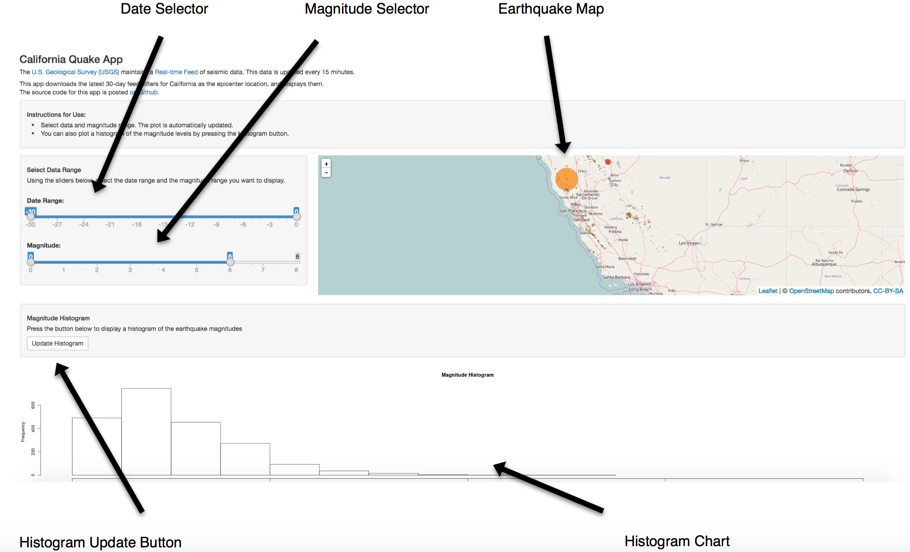

Quake Visualization - Developing Data Products Course Project
========================================================
author: Data Dirk
date: 21 August 2016
autosize: true

Project Scope
========================================================
<small>
This presentation describes the course project for the Coursera Data Science Specialization Course - *Developing Data Products* [[1]](https://www.coursera.org/learn/data-products/home/welcome).
The project consists of two parts:

1. development of a Shiny application and deployment on Rstudio's servers
2. creation of a reproducible pitch presentation that describes the application

<br><br>
The visualization of earthquake data was chosen as the topic for this project:

The US Geological Survey maintains a realtime database of global seismic events [[2]](http://earthquake.usgs.gov/earthquakes/feed/v1.0/csv.php). 
This data is updated every 15 minutes. The Shiny App developed for this project downloads this data and allows to visualize seismic events in california.

The link to the Shiny App is:  [QuakeVisualization](https://datadirk.shinyapps.io/QuakeVisualization/)
</small>
Data
========================================================
<small>The USGS data used in the app is the 30-day list of all global seismic events:


```r
URL <- "https://earthquake.usgs.gov/earthquakes/feed/v1.0/summary/all_month.csv"
Quake_30days <- read.table(URL, sep = ",", header = T)
```

It contains multiple variables.

```r
names(Quake_30days)
```

```
 [1] "time"            "latitude"        "longitude"       "depth"          
 [5] "mag"             "magType"         "nst"             "gap"            
 [9] "dmin"            "rms"             "net"             "id"             
[13] "updated"         "place"           "type"            "horizontalError"
[17] "depthError"      "magError"        "magNst"          "status"         
[21] "locationSource"  "magSource"      
```

</small>

Data Processing
========================================================
<small>
The Shiny App 
* downloads the latest feed file of seismic events in the past 30 days,
* filters the data to ```place``` containing the word "california"
* filters the data further according to the user input in the app
* displays the earthquake location on the map, the circles sized according to magnitude, i.e., `radius = ~10^mag/2`.
* Creates a histogram triggered by a button click.

</small>
Shiny App
========================================================
<small>
<div align="top">

</div>

How to use:
* Use Date Selector to select event date during the past 30 days
* Use Magntude Selector to filter to magnitude range
* Press "Update Histogram" to create histogram of magnitude distribution
</small>
References
========================================================

[1]: Developing Data Products Course on Coursera.com -  [https://www.coursera.org/learn/data-products/home/welcome](https://www.coursera.org/learn/data-products/home/welcome)

[2]: USGS Real-time Earthquake Feeds -  [https://earthquake.usgs.gov/earthquakes/feed/v1.0/csv.php](https://earthquake.usgs.gov/earthquakes/feed/v1.0/csv.php)

[3]: Quake Visualization App on Shinyapps.io -  [https://datadirk.shinyapps.io/QuakeVisualization/](https://datadirk.shinyapps.io/QuakeVisualization/)

[4]: Shiny App Source Code on Github -  [https://github.com/DataDirk/datasciencecoursera-Projects/tree/master/09%20Developing%20Data%20Products%20Project/QuakeVisualization](https://github.com/DataDirk/datasciencecoursera-Projects/tree/master/09%20Developing%20Data%20Products%20Project/QuakeVisualization)
